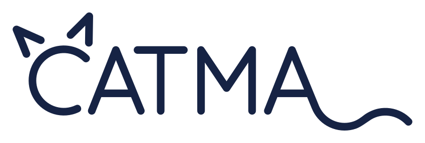
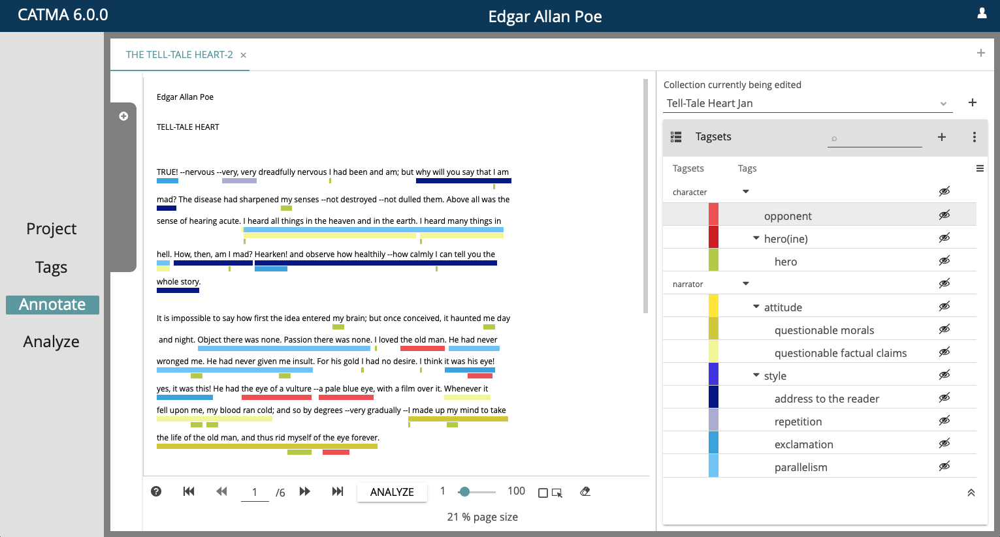

    
    
Computer Assisted Text Markup and Analysis

     
    

        <a href="https://catma.de" target="_blank" rel="noopener"><strong>Website</strong></a> |
        <a href="https://catma.de/how-to/tutorials/" target="_blank" rel="noopener"><strong>Tutorials</strong></a> |
        <a href="https://catma.de/how-to/compact-manual/" target="_blank" rel="noopener"><strong>Compact Manual</strong></a> |
        <a href="https://catma.de/how-to/faqs/" target="_blank" rel="noopener"><strong>FAQs</strong></a>
    

---

# Introduction

CATMA is a web-based, open-source and free-to-use application for text annotation and analysis.

With CATMA, users such as literary scholars can work in the way that best suits their scientific objectives: qualitative or quantitative, bottom-up and
exploratory or descriptive and taxonomy-based, alone or as a team.

It has a project-centered, modular architecture and supports most file formats and text languages, including those that are written from right to left.
Versioning is built-in, and user data can be exported or accessed in a variety of ways.

There is a free [public instance](https://app.catma.de), or you can choose to [host your own instance](#host-your-own-instance) or use the
[standalone version](#standalone-version) (also works offline).

For more information, please visit our [website](https://catma.de) or check out the other links below the logo ↑

# Technical Requirements & Information

To use the [public instance](https://app.catma.de), all you need is a web browser.

Apart from the application itself, CATMA uses a GitLab instance as its backend to store and manage projects' resources and members. (Visit our
[technology and versions](https://catma.de/documentation/technology-and-versions/) page for further details about the different application components.)

# Support

Please check the [FAQs](https://catma.de/how-to/faqs/), the [compact manual](https://catma.de/how-to/compact-manual/), the
[tutorials](https://catma.de/how-to/tutorials/), and the other materials available on [our website](https://catma.de) for an answer to your question first.

Still stuck or unsure? Then feel free to send an email to [support@catma.de](mailto://support@catma.de) and we will get back to you as soon as possible. If you
think you have found a bug, or if you would like to request a feature, you can also [create a new issue](https://github.com/forTEXT/catma/issues/new/choose).

# Host Your Own Instance

To host your own instance, you need a Java web server and servlet container, and you also need to set up your own GitLab server. As the setup and configuration
can be complicated, we highly recommend that you use our provided Docker image – the [standalone version](#standalone-version).

If you don't want to use the Docker image, further self-hosting instructions can be found [here](doc/SELF-HOSTING.md).

# Standalone Version

CATMA Standalone is a version of CATMA that can be run independently of the publicly accessible web application. It is designed for users who want to run CATMA
on their local machine or in a private network (and where internet access might not be available).

You can find the documentation for CATMA Standalone [here](docker/README.md).

# Development

You want to work on the CATMA codebase? See the [development documentation](doc/DEVELOPMENT.md).
